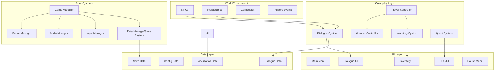
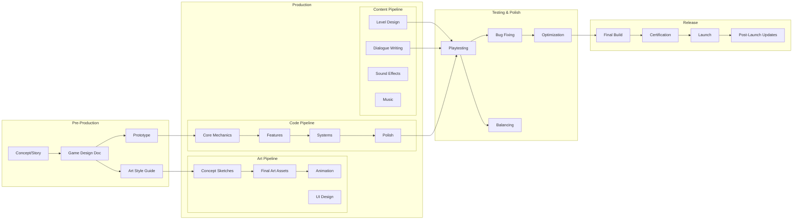
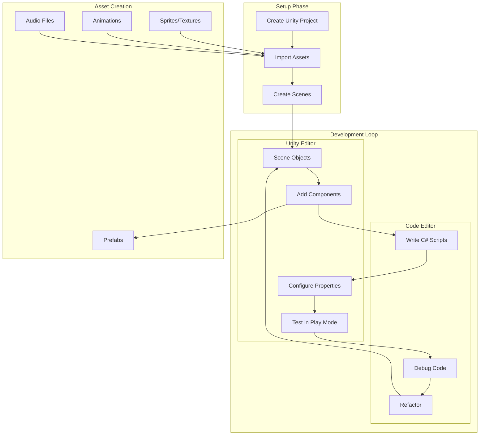
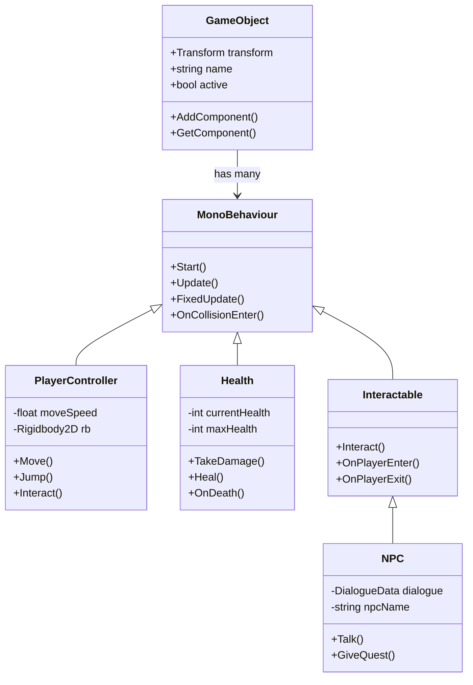

# Game Architecture and Workflow Diagrams

## 1. Typical Game Architecture Structure

## 2. Game Development Workflow

## 3. Unity-Specific Development Cycle

## 4. Component-Based Architecture (Unity Pattern)

